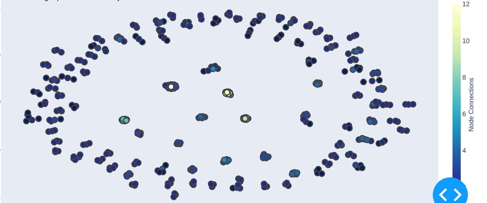

# Duplicate Detection

This repository carries the source code and instructions for the duplication detection service deployed in X5GON

- [X] [This](src/duplicate_update.py) file contains the script to update the X5GON DB with documents which contains exact same values in a newly created column <strong> duplicate(boolean) </strong> as <strong> TRUE </strong>
  

  ```8542 exact duplicate materials was found with 3230 distinct values which implies 5312 documents can be disregarded as duplicates```
- [X] [This](src/deduplicate.py) file was used to detect all the duplicate clusters in the X5GON DB using <strong> TF (Term Frequency) and WIKI </strong> as metrics to determine whether a pair of document is a duplicate or not.
    

  ```TF > 0.85 and WIKI > 0.95 were used as thresholds for a document pair to be considered as a Duplicate.```
  
[comment]: <> (![img.png]&#40;img.png&#41;)
[This](results_deuplicate_detection.csv) contains the results obtained using the above proposed method. This contains material IDs of all the documents with material IDs of their respective detected duplicates. This result was used to plot the following graph to analyse the result visually.

 This interactive graph was used to evaluate the results produced by the above proposed method. Each dot represents a documents and clusters represent a set of duplicate documents.

### [This](https://docs.google.com/spreadsheets/d/1fI6JprYWbCgV5_EwoBrwkZ07jZ2v-MM5ukPkWoDpcJc/edit?usp=sharing) is the results of a manual evaluation done using the above obtained results

## - TODO -
- [ ] Write the script for the cron job to be run on the X5GON server to update duplicates of future OER materials.
- [ ] Write the script to update the DB with a new table using [obtained results](results_deuplicate_detection.csv) 